# Projects and dependencies analysis

This document provides a comprehensive overview of the projects and their dependencies in the context of upgrading to .NETCoreApp,Version=v10.0.

## Table of Contents

- [Executive Summary](#executive-Summary)
  - [Highlevel Metrics](#highlevel-metrics)
  - [Projects Compatibility](#projects-compatibility)
  - [Package Compatibility](#package-compatibility)
  - [API Compatibility](#api-compatibility)
- [Aggregate NuGet packages details](#aggregate-nuget-packages-details)
- [Top API Migration Challenges](#top-api-migration-challenges)
  - [Technologies and Features](#technologies-and-features)
  - [Most Frequent API Issues](#most-frequent-api-issues)
- [Projects Relationship Graph](#projects-relationship-graph)
- [Project Details](#project-details)

  - [Asio\Asio.csproj](#asioasiocsproj)
  - [Audio\Audio.csproj](#audioaudiocsproj)
  - [Benchmarks\Benchmarks.csproj](#benchmarksbenchmarkscsproj)
  - [Circuit\Circuit.csproj](#circuitcircuitcsproj)
  - [ComputerAlgebra\ComputerAlgebra\ComputerAlgebra.csproj](#computeralgebracomputeralgebracomputeralgebracsproj)
  - [LiveSPICE\LiveSPICE.csproj](#livespicelivespicecsproj)
  - [LiveSPICEVst\LiveSPICEVst.csproj](#livespicevstlivespicevstcsproj)
  - [MockVst\MockVst.csproj](#mockvstmockvstcsproj)
  - [SchematicControls\SchematicControls.csproj](#schematiccontrolsschematiccontrolscsproj)
  - [Tests\Tests.csproj](#teststestscsproj)
  - [Util\Util.csproj](#utilutilcsproj)
  - [WaveAudio\WaveAudio.csproj](#waveaudiowaveaudiocsproj)

## Executive Summary

### Highlevel Metrics

| Metric | Count | Status |
| :--- | :---: | :--- |
| Total Projects | 12 | All require upgrade |
| Total NuGet Packages | 16 | 2 need upgrade |
| Total Code Files | 268 |  |
| Total Code Files with Incidents | 102 |  |
| Total Lines of Code | 27734 |  |
| Total Number of Issues | 4904 |  |
| Estimated LOC to modify | 4882+ | at least 17.6% of codebase |

### Projects Compatibility

| Project | Target Framework | Difficulty | Package Issues | API Issues | Est. LOC Impact | Description |
| :--- | :---: | :---: | :---: | :---: | :---: | :--- |
| [Asio\Asio.csproj](#asioasiocsproj) | netstandard2.0 | 🟢 Low | 2 | 0 |  | ClassLibrary, Sdk Style = True |
| [Audio\Audio.csproj](#audioaudiocsproj) | netstandard2.0 | 🟢 Low | 3 | 0 |  | ClassLibrary, Sdk Style = True |
| [Benchmarks\Benchmarks.csproj](#benchmarksbenchmarkscsproj) | net6.0-windows | 🟢 Low | 0 | 0 |  | DotNetCoreApp, Sdk Style = True |
| [Circuit\Circuit.csproj](#circuitcircuitcsproj) | netstandard2.0 | 🟢 Low | 2 | 0 |  | ClassLibrary, Sdk Style = True |
| [ComputerAlgebra\ComputerAlgebra\ComputerAlgebra.csproj](#computeralgebracomputeralgebracomputeralgebracsproj) | netstandard2.0 | 🟢 Low | 1 | 184 | 184+ | ClassLibrary, Sdk Style = True |
| [LiveSPICE\LiveSPICE.csproj](#livespicelivespicecsproj) | net6.0-windows | 🟡 Medium | 1 | 3800 | 3800+ | Wpf, Sdk Style = True |
| [LiveSPICEVst\LiveSPICEVst.csproj](#livespicevstlivespicevstcsproj) | net8.0-windows | 🟡 Medium | 2 | 247 | 247+ | Wpf, Sdk Style = True |
| [MockVst\MockVst.csproj](#mockvstmockvstcsproj) | net8.0-windows | 🟢 Low | 1 | 36 | 36+ | Wpf, Sdk Style = True |
| [SchematicControls\SchematicControls.csproj](#schematiccontrolsschematiccontrolscsproj) | net6.0-windows | 🟡 Medium | 1 | 353 | 353+ | Wpf, Sdk Style = True |
| [Tests\Tests.csproj](#teststestscsproj) | net6.0-windows | 🟡 Medium | 1 | 262 | 262+ | DotNetCoreApp, Sdk Style = True |
| [Util\Util.csproj](#utilutilcsproj) | netstandard2.0 | 🟢 Low | 1 | 0 |  | ClassLibrary, Sdk Style = True |
| [WaveAudio\WaveAudio.csproj](#waveaudiowaveaudiocsproj) | netstandard2.0 | 🟢 Low | 1 | 0 |  | ClassLibrary, Sdk Style = True |

### Package Compatibility

| Status | Count | Percentage |
| :--- | :---: | :---: |
| ✅ Compatible | 14 | 87.5% |
| ⚠️ Incompatible | 1 | 6.3% |
| 🔄 Upgrade Recommended | 1 | 6.3% |
| ***Total NuGet Packages*** | ***16*** | ***100%*** |

### API Compatibility

| Category | Count | Impact |
| :--- | :---: | :--- |
| 🔴 Binary Incompatible | 4433 | High - Require code changes |
| 🟡 Source Incompatible | 391 | Medium - Needs re-compilation and potential conflicting API error fixing |
| 🔵 Behavioral change | 58 | Low - Behavioral changes that may require testing at runtime |
| ✅ Compatible | 24135 |  |
| ***Total APIs Analyzed*** | ***29017*** |  |

## Aggregate NuGet packages details

| Package | Current Version | Suggested Version | Projects | Description |
| :--- | :---: | :---: | :--- | :--- |
| AgileObjects.NetStandardPolyfills | 1.4.1 |  | [LiveSPICE.csproj](#livespicelivespicecsproj) | ✅Compatible |
| AgileObjects.ReadableExpressions | 2.5.1 |  | [LiveSPICE.csproj](#livespicelivespicecsproj) | ✅Compatible |
| AudioPlugSharp | 0.6.10 |  | [LiveSPICEVst.csproj](#livespicevstlivespicevstcsproj) | ✅Compatible |
| AudioPlugSharpWPF | 0.6.10 |  | [LiveSPICEVst.csproj](#livespicevstlivespicevstcsproj) | ⚠️NuGet package is incompatible |
| BenchmarkDotNet | 0.13.1 |  | [Benchmarks.csproj](#benchmarksbenchmarkscsproj) | ✅Compatible |
| BenchmarkDotNet.Diagnostics.Windows | 0.13.1 |  | [Benchmarks.csproj](#benchmarksbenchmarkscsproj) | ✅Compatible |
| Dirkster.AvalonDock | 4.40.0 |  | [LiveSPICE.csproj](#livespicelivespicecsproj) | ✅Compatible |
| DotNetProjects.Extended.Wpf.Toolkit | 4.6.86 |  | [LiveSPICE.csproj](#livespicelivespicecsproj) | ✅Compatible |
| MathNet.Numerics | 4.12.0 |  | [Benchmarks.csproj](#benchmarksbenchmarkscsproj) [LiveSPICE.csproj](#livespicelivespicecsproj) | ✅Compatible |
| Microsoft.CSharp | 4.7.0 |  | [Asio.csproj](#asioasiocsproj) [Audio.csproj](#audioaudiocsproj) [Circuit.csproj](#circuitcircuitcsproj) [ComputerAlgebra.csproj](#computeralgebracomputeralgebracomputeralgebracsproj) [LiveSPICE.csproj](#livespicelivespicecsproj) [LiveSPICEVst.csproj](#livespicevstlivespicevstcsproj) [MockVst.csproj](#mockvstmockvstcsproj) [SchematicControls.csproj](#schematiccontrolsschematiccontrolscsproj) [Tests.csproj](#teststestscsproj) [Util.csproj](#utilutilcsproj) [WaveAudio.csproj](#waveaudiowaveaudiocsproj) | ✅Compatible |
| Microsoft.Win32.Registry | 5.0.0 |  | [Asio.csproj](#asioasiocsproj) | NuGet package functionality is included with framework reference |
| NETStandard.Library | 2.0.3 |  | [Asio.csproj](#asioasiocsproj) [Audio.csproj](#audioaudiocsproj) [Circuit.csproj](#circuitcircuitcsproj) [ComputerAlgebra.csproj](#computeralgebracomputeralgebracomputeralgebracsproj) [Util.csproj](#utilutilcsproj) [WaveAudio.csproj](#waveaudiowaveaudiocsproj) | ✅Compatible |
| System.CommandLine | 2.0.0-beta1.21308.1 |  | [Tests.csproj](#teststestscsproj) | ✅Compatible |
| System.Data.DataSetExtensions | 4.5.0 |  | [Asio.csproj](#asioasiocsproj) [Audio.csproj](#audioaudiocsproj) [Circuit.csproj](#circuitcircuitcsproj) [ComputerAlgebra.csproj](#computeralgebracomputeralgebracomputeralgebracsproj) [LiveSPICE.csproj](#livespicelivespicecsproj) [LiveSPICEVst.csproj](#livespicevstlivespicevstcsproj) [MockVst.csproj](#mockvstmockvstcsproj) [SchematicControls.csproj](#schematiccontrolsschematiccontrolscsproj) [Tests.csproj](#teststestscsproj) [Util.csproj](#utilutilcsproj) [WaveAudio.csproj](#waveaudiowaveaudiocsproj) | NuGet package functionality is included with framework reference |
| System.Numerics.Vectors | 4.5.0 |  | [Circuit.csproj](#circuitcircuitcsproj) | NuGet package functionality is included with framework reference |
| System.Runtime.CompilerServices.Unsafe | 5.0.0 | 6.1.2 | [Audio.csproj](#audioaudiocsproj) | NuGet package upgrade is recommended |

## Top API Migration Challenges

### Technologies and Features

| Technology | Issues | Percentage | Migration Path |
| :--- | :---: | :---: | :--- |
| WPF (Windows Presentation Foundation) | 2573 | 52.7% | WPF APIs for building Windows desktop applications with XAML-based UI that are available in .NET on Windows. WPF provides rich desktop UI capabilities with data binding and styling. Enable Windows Desktop support: Option 1 (Recommended): Target net9.0-windows; Option 2: Add <UseWindowsDesktop>true</UseWindowsDesktop>. |
| Windows Forms | 156 | 3.2% | Windows Forms APIs for building Windows desktop applications with traditional Forms-based UI that are available in .NET on Windows. Enable Windows Desktop support: Option 1 (Recommended): Target net9.0-windows; Option 2: Add <UseWindowsDesktop>true</UseWindowsDesktop>; Option 3 (Legacy): Use Microsoft.NET.Sdk.WindowsDesktop SDK. |
| GDI+ / System.Drawing | 125 | 2.6% | System.Drawing APIs for 2D graphics, imaging, and printing that are available via NuGet package System.Drawing.Common. Note: Not recommended for server scenarios due to Windows dependencies; consider cross-platform alternatives like SkiaSharp or ImageSharp for new code. |
| Legacy Configuration System | 37 | 0.8% | Legacy XML-based configuration system (app.config/web.config) that has been replaced by a more flexible configuration model in .NET Core. The old system was rigid and XML-based. Migrate to Microsoft.Extensions.Configuration with JSON/environment variables; use System.Configuration.ConfigurationManager NuGet package as interim bridge if needed. |

### Most Frequent API Issues

| API | Count | Percentage | Category |
| :--- | :---: | :---: | :--- |
| T:System.Numerics.BigInteger | 182 | 3.7% | Source Incompatible |
| T:System.Windows.Point | 118 | 2.4% | Binary Incompatible |
| T:System.Windows.Visibility | 93 | 1.9% | Binary Incompatible |
| T:System.Windows.Media.Pen | 93 | 1.9% | Binary Incompatible |
| T:System.Windows.RoutedEventHandler | 67 | 1.4% | Binary Incompatible |
| T:System.Windows.Controls.Canvas | 64 | 1.3% | Binary Incompatible |
| T:System.Windows.Media.Brush | 59 | 1.2% | Binary Incompatible |
| T:System.Windows.Input.MouseEventHandler | 56 | 1.1% | Binary Incompatible |
| T:System.Windows.Input.ModifierKeys | 49 | 1.0% | Binary Incompatible |
| T:System.Windows.Input.RoutedUICommand | 47 | 1.0% | Binary Incompatible |
| T:System.Windows.MessageBoxButton | 46 | 0.9% | Binary Incompatible |
| T:System.Windows.Input.Key | 46 | 0.9% | Binary Incompatible |
| T:System.Windows.Controls.Button | 43 | 0.9% | Binary Incompatible |
| T:System.Windows.Controls.ItemCollection | 42 | 0.9% | Binary Incompatible |
| P:System.Windows.Controls.ItemsControl.Items | 42 | 0.9% | Binary Incompatible |
| T:System.Windows.Input.RoutedCommand | 41 | 0.8% | Binary Incompatible |
| T:System.Windows.Input.Cursor | 40 | 0.8% | Binary Incompatible |
| T:System.Windows.Window | 39 | 0.8% | Binary Incompatible |
| T:System.Windows.Application | 37 | 0.8% | Binary Incompatible |
| T:System.Windows.MessageBoxResult | 37 | 0.8% | Binary Incompatible |
| T:System.Windows.Controls.Image | 37 | 0.8% | Binary Incompatible |
| T:System.Windows.DependencyProperty | 34 | 0.7% | Binary Incompatible |
| T:System.Windows.Input.CommandBinding | 33 | 0.7% | Binary Incompatible |
| T:System.Windows.Input.CommandBindingCollection | 33 | 0.7% | Binary Incompatible |
| P:System.Windows.UIElement.CommandBindings | 33 | 0.7% | Binary Incompatible |
| M:System.Windows.Input.CommandBindingCollection.Add(System.Windows.Input.CommandBinding) | 33 | 0.7% | Binary Incompatible |
| M:System.Windows.UIElement.InvalidateVisual | 32 | 0.7% | Binary Incompatible |
| T:System.Windows.Controls.ScrollViewer | 32 | 0.7% | Binary Incompatible |
| T:System.Windows.Forms.Form | 32 | 0.7% | Binary Incompatible |
| P:System.Windows.UIElement.Visibility | 31 | 0.6% | Binary Incompatible |
| M:System.Windows.Point.#ctor(System.Double,System.Double) | 31 | 0.6% | Binary Incompatible |
| T:System.Windows.Media.SolidColorBrush | 29 | 0.6% | Binary Incompatible |
| T:System.Windows.Input.ApplicationCommands | 29 | 0.6% | Binary Incompatible |
| P:System.Windows.Point.X | 29 | 0.6% | Binary Incompatible |
| T:System.Windows.Controls.ComboBox | 29 | 0.6% | Binary Incompatible |
| T:System.Uri | 28 | 0.6% | Behavioral Change |
| P:System.Windows.Point.Y | 28 | 0.6% | Binary Incompatible |
| P:System.Windows.Controls.ContentControl.Content | 27 | 0.6% | Binary Incompatible |
| T:System.Windows.FrameworkElement | 27 | 0.6% | Binary Incompatible |
| P:System.Windows.FrameworkElement.Height | 27 | 0.6% | Binary Incompatible |
| P:System.Windows.FrameworkElement.Width | 27 | 0.6% | Binary Incompatible |
| T:System.Windows.Shapes.Path | 26 | 0.5% | Binary Incompatible |
| T:System.Windows.Media.Brushes | 25 | 0.5% | Binary Incompatible |
| P:System.Windows.FrameworkElement.Tag | 24 | 0.5% | Binary Incompatible |
| T:System.Windows.Input.MouseButton | 24 | 0.5% | Binary Incompatible |
| T:System.Windows.Media.PenLineCap | 24 | 0.5% | Binary Incompatible |
| M:System.Uri.#ctor(System.String,System.UriKind) | 23 | 0.5% | Behavioral Change |
| T:System.Windows.RoutedEventArgs | 23 | 0.5% | Binary Incompatible |
| T:System.Windows.Rect | 23 | 0.5% | Binary Incompatible |
| M:System.Windows.Controls.ItemCollection.Add(System.Object) | 22 | 0.5% | Binary Incompatible |

## Projects Relationship Graph

Legend:
📦 SDK-style project
⚙️ Classic project

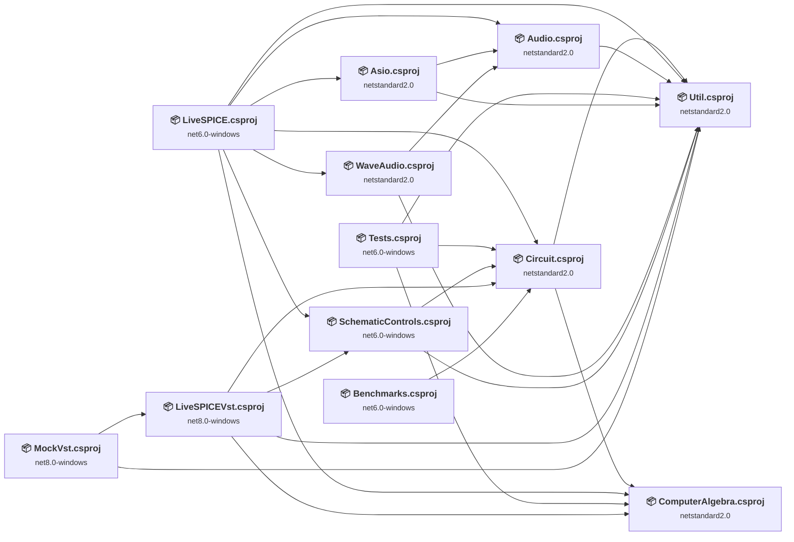

## Project Details

### Asio\Asio.csproj

#### Project Info

- **Current Target Framework:** netstandard2.0✅
- **SDK-style**: True
- **Project Kind:** ClassLibrary
- **Dependencies**: 2
- **Dependants**: 1
- **Number of Files**: 4
- **Number of Files with Incidents**: 1
- **Lines of Code**: 761
- **Estimated LOC to modify**: 0+ (at least 0.0% of the project)

#### Dependency Graph

Legend:
📦 SDK-style project
⚙️ Classic project

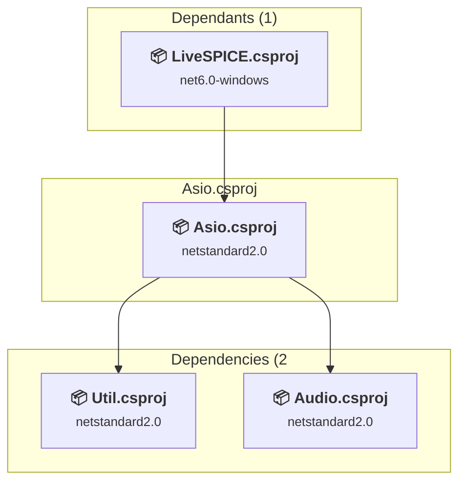

### API Compatibility

| Category | Count | Impact |
| :--- | :---: | :--- |
| 🔴 Binary Incompatible | 0 | High - Require code changes |
| 🟡 Source Incompatible | 0 | Medium - Needs re-compilation and potential conflicting API error fixing |
| 🔵 Behavioral change | 0 | Low - Behavioral changes that may require testing at runtime |
| ✅ Compatible | 529 |  |
| ***Total APIs Analyzed*** | ***529*** |  |

### Audio\Audio.csproj

#### Project Info

- **Current Target Framework:** netstandard2.0✅
- **SDK-style**: True
- **Project Kind:** ClassLibrary
- **Dependencies**: 1
- **Dependants**: 3
- **Number of Files**: 5
- **Number of Files with Incidents**: 1
- **Lines of Code**: 251
- **Estimated LOC to modify**: 0+ (at least 0.0% of the project)

#### Dependency Graph

Legend:
📦 SDK-style project
⚙️ Classic project

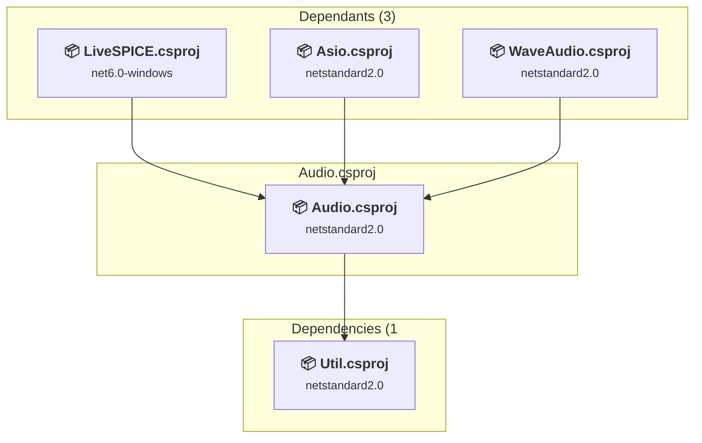

### API Compatibility

| Category | Count | Impact |
| :--- | :---: | :--- |
| 🔴 Binary Incompatible | 0 | High - Require code changes |
| 🟡 Source Incompatible | 0 | Medium - Needs re-compilation and potential conflicting API error fixing |
| 🔵 Behavioral change | 0 | Low - Behavioral changes that may require testing at runtime |
| ✅ Compatible | 226 |  |
| ***Total APIs Analyzed*** | ***226*** |  |

### Benchmarks\Benchmarks.csproj

#### Project Info

- **Current Target Framework:** net6.0-windows
- **Proposed Target Framework:** net10.0--windows
- **SDK-style**: True
- **Project Kind:** DotNetCoreApp
- **Dependencies**: 1
- **Dependants**: 0
- **Number of Files**: 2
- **Number of Files with Incidents**: 1
- **Lines of Code**: 352
- **Estimated LOC to modify**: 0+ (at least 0.0% of the project)

#### Dependency Graph

Legend:
📦 SDK-style project
⚙️ Classic project

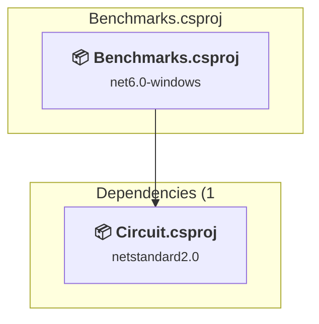

### API Compatibility

| Category | Count | Impact |
| :--- | :---: | :--- |
| 🔴 Binary Incompatible | 0 | High - Require code changes |
| 🟡 Source Incompatible | 0 | Medium - Needs re-compilation and potential conflicting API error fixing |
| 🔵 Behavioral change | 0 | Low - Behavioral changes that may require testing at runtime |
| ✅ Compatible | 200 |  |
| ***Total APIs Analyzed*** | ***200*** |  |

### Circuit\Circuit.csproj

#### Project Info

- **Current Target Framework:** netstandard2.0✅
- **SDK-style**: True
- **Project Kind:** ClassLibrary
- **Dependencies**: 2
- **Dependants**: 5
- **Number of Files**: 66
- **Number of Files with Incidents**: 1
- **Lines of Code**: 6495
- **Estimated LOC to modify**: 0+ (at least 0.0% of the project)

#### Dependency Graph

Legend:
📦 SDK-style project
⚙️ Classic project

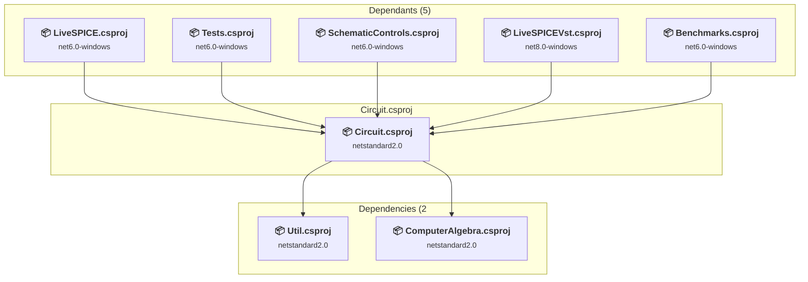

### API Compatibility

| Category | Count | Impact |
| :--- | :---: | :--- |
| 🔴 Binary Incompatible | 0 | High - Require code changes |
| 🟡 Source Incompatible | 0 | Medium - Needs re-compilation and potential conflicting API error fixing |
| 🔵 Behavioral change | 0 | Low - Behavioral changes that may require testing at runtime |
| ✅ Compatible | 5800 |  |
| ***Total APIs Analyzed*** | ***5800*** |  |

### ComputerAlgebra\ComputerAlgebra\ComputerAlgebra.csproj

#### Project Info

- **Current Target Framework:** netstandard2.0✅
- **SDK-style**: True
- **Project Kind:** ClassLibrary
- **Dependencies**: 0
- **Dependants**: 4
- **Number of Files**: 100
- **Number of Files with Incidents**: 5
- **Lines of Code**: 10187
- **Estimated LOC to modify**: 184+ (at least 1.8% of the project)

#### Dependency Graph

Legend:
📦 SDK-style project
⚙️ Classic project

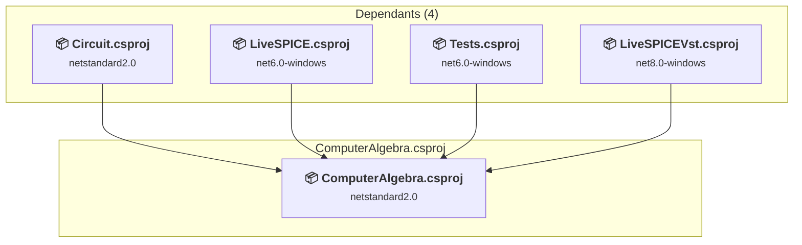

### API Compatibility

| Category | Count | Impact |
| :--- | :---: | :--- |
| 🔴 Binary Incompatible | 0 | High - Require code changes |
| 🟡 Source Incompatible | 182 | Medium - Needs re-compilation and potential conflicting API error fixing |
| 🔵 Behavioral change | 2 | Low - Behavioral changes that may require testing at runtime |
| ✅ Compatible | 6970 |  |
| ***Total APIs Analyzed*** | ***7154*** |  |

### LiveSPICE\LiveSPICE.csproj

#### Project Info

- **Current Target Framework:** net6.0-windows
- **Proposed Target Framework:** net10.0-windows
- **SDK-style**: True
- **Project Kind:** Wpf
- **Dependencies**: 7
- **Dependants**: 0
- **Number of Files**: 53
- **Number of Files with Incidents**: 59
- **Lines of Code**: 5808
- **Estimated LOC to modify**: 3800+ (at least 65.4% of the project)

#### Dependency Graph

Legend:
📦 SDK-style project
⚙️ Classic project

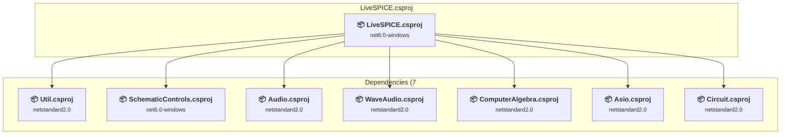

### API Compatibility

| Category | Count | Impact |
| :--- | :---: | :--- |
| 🔴 Binary Incompatible | 3732 | High - Require code changes |
| 🟡 Source Incompatible | 33 | Medium - Needs re-compilation and potential conflicting API error fixing |
| 🔵 Behavioral change | 35 | Low - Behavioral changes that may require testing at runtime |
| ✅ Compatible | 5900 |  |
| ***Total APIs Analyzed*** | ***9700*** |  |

#### Project Technologies and Features

| Technology | Issues | Percentage | Migration Path |
| :--- | :---: | :---: | :--- |
| Legacy Configuration System | 33 | 0.9% | Legacy XML-based configuration system (app.config/web.config) that has been replaced by a more flexible configuration model in .NET Core. The old system was rigid and XML-based. Migrate to Microsoft.Extensions.Configuration with JSON/environment variables; use System.Configuration.ConfigurationManager NuGet package as interim bridge if needed. |
| Windows Forms | 66 | 1.7% | Windows Forms APIs for building Windows desktop applications with traditional Forms-based UI that are available in .NET on Windows. Enable Windows Desktop support: Option 1 (Recommended): Target net9.0-windows; Option 2: Add <UseWindowsDesktop>true</UseWindowsDesktop>; Option 3 (Legacy): Use Microsoft.NET.Sdk.WindowsDesktop SDK. |
| WPF (Windows Presentation Foundation) | 2248 | 59.2% | WPF APIs for building Windows desktop applications with XAML-based UI that are available in .NET on Windows. WPF provides rich desktop UI capabilities with data binding and styling. Enable Windows Desktop support: Option 1 (Recommended): Target net9.0-windows; Option 2: Add <UseWindowsDesktop>true</UseWindowsDesktop>. |

### LiveSPICEVst\LiveSPICEVst.csproj

#### Project Info

- **Current Target Framework:** net8.0-windows
- **Proposed Target Framework:** net10.0-windows
- **SDK-style**: True
- **Project Kind:** Wpf
- **Dependencies**: 4
- **Dependants**: 1
- **Number of Files**: 16
- **Number of Files with Incidents**: 15
- **Lines of Code**: 1092
- **Estimated LOC to modify**: 247+ (at least 22.6% of the project)

#### Dependency Graph

Legend:
📦 SDK-style project
⚙️ Classic project

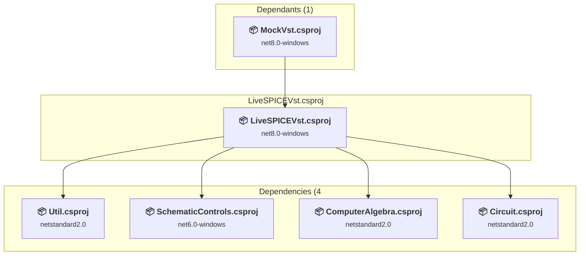

### API Compatibility

| Category | Count | Impact |
| :--- | :---: | :--- |
| 🔴 Binary Incompatible | 231 | High - Require code changes |
| 🟡 Source Incompatible | 0 | Medium - Needs re-compilation and potential conflicting API error fixing |
| 🔵 Behavioral change | 16 | Low - Behavioral changes that may require testing at runtime |
| ✅ Compatible | 947 |  |
| ***Total APIs Analyzed*** | ***1194*** |  |

#### Project Technologies and Features

| Technology | Issues | Percentage | Migration Path |
| :--- | :---: | :---: | :--- |
| WPF (Windows Presentation Foundation) | 127 | 51.4% | WPF APIs for building Windows desktop applications with XAML-based UI that are available in .NET on Windows. WPF provides rich desktop UI capabilities with data binding and styling. Enable Windows Desktop support: Option 1 (Recommended): Target net9.0-windows; Option 2: Add <UseWindowsDesktop>true</UseWindowsDesktop>. |

### MockVst\MockVst.csproj

#### Project Info

- **Current Target Framework:** net8.0-windows
- **Proposed Target Framework:** net10.0-windows
- **SDK-style**: True
- **Project Kind:** Wpf
- **Dependencies**: 2
- **Dependants**: 0
- **Number of Files**: 6
- **Number of Files with Incidents**: 6
- **Lines of Code**: 211
- **Estimated LOC to modify**: 36+ (at least 17.1% of the project)

#### Dependency Graph

Legend:
📦 SDK-style project
⚙️ Classic project

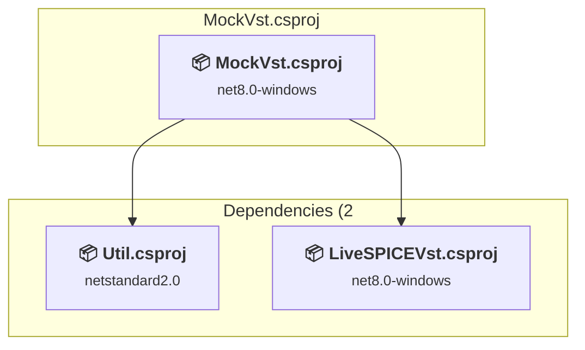

### API Compatibility

| Category | Count | Impact |
| :--- | :---: | :--- |
| 🔴 Binary Incompatible | 29 | High - Require code changes |
| 🟡 Source Incompatible | 2 | Medium - Needs re-compilation and potential conflicting API error fixing |
| 🔵 Behavioral change | 5 | Low - Behavioral changes that may require testing at runtime |
| ✅ Compatible | 243 |  |
| ***Total APIs Analyzed*** | ***279*** |  |

#### Project Technologies and Features

| Technology | Issues | Percentage | Migration Path |
| :--- | :---: | :---: | :--- |
| Legacy Configuration System | 2 | 5.6% | Legacy XML-based configuration system (app.config/web.config) that has been replaced by a more flexible configuration model in .NET Core. The old system was rigid and XML-based. Migrate to Microsoft.Extensions.Configuration with JSON/environment variables; use System.Configuration.ConfigurationManager NuGet package as interim bridge if needed. |
| WPF (Windows Presentation Foundation) | 11 | 30.6% | WPF APIs for building Windows desktop applications with XAML-based UI that are available in .NET on Windows. WPF provides rich desktop UI capabilities with data binding and styling. Enable Windows Desktop support: Option 1 (Recommended): Target net9.0-windows; Option 2: Add <UseWindowsDesktop>true</UseWindowsDesktop>. |

### SchematicControls\SchematicControls.csproj

#### Project Info

- **Current Target Framework:** net6.0-windows
- **Proposed Target Framework:** net10.0-windows
- **SDK-style**: True
- **Project Kind:** Wpf
- **Dependencies**: 2
- **Dependants**: 2
- **Number of Files**: 6
- **Number of Files with Incidents**: 5
- **Lines of Code**: 531
- **Estimated LOC to modify**: 353+ (at least 66.5% of the project)

#### Dependency Graph

Legend:
📦 SDK-style project
⚙️ Classic project

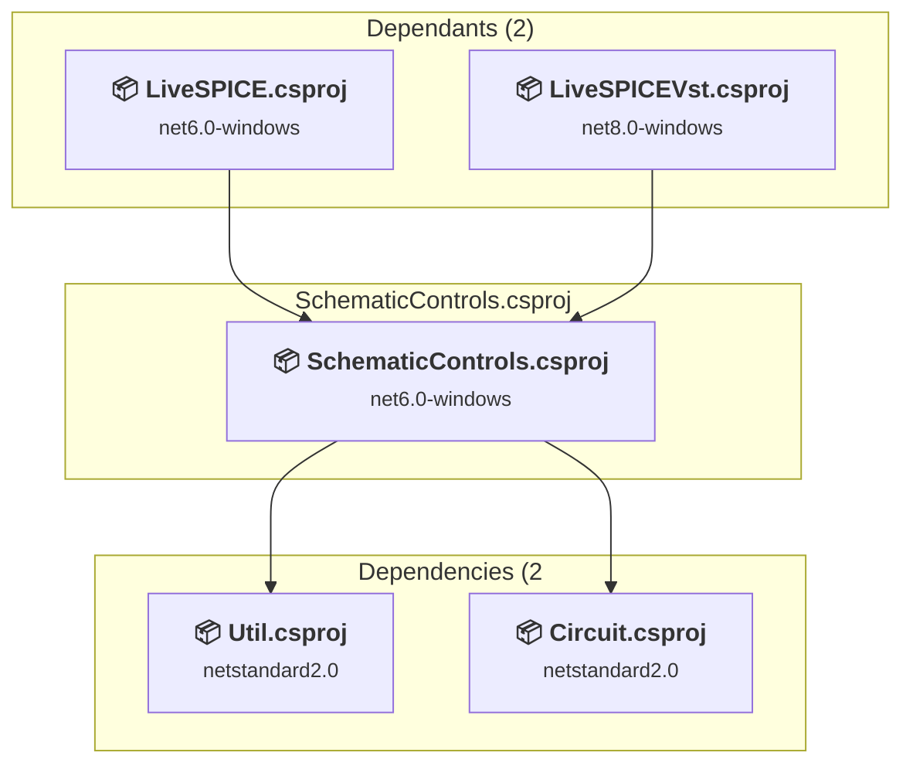

### API Compatibility

| Category | Count | Impact |
| :--- | :---: | :--- |
| 🔴 Binary Incompatible | 351 | High - Require code changes |
| 🟡 Source Incompatible | 2 | Medium - Needs re-compilation and potential conflicting API error fixing |
| 🔵 Behavioral change | 0 | Low - Behavioral changes that may require testing at runtime |
| ✅ Compatible | 640 |  |
| ***Total APIs Analyzed*** | ***993*** |  |

#### Project Technologies and Features

| Technology | Issues | Percentage | Migration Path |
| :--- | :---: | :---: | :--- |
| Legacy Configuration System | 2 | 0.6% | Legacy XML-based configuration system (app.config/web.config) that has been replaced by a more flexible configuration model in .NET Core. The old system was rigid and XML-based. Migrate to Microsoft.Extensions.Configuration with JSON/environment variables; use System.Configuration.ConfigurationManager NuGet package as interim bridge if needed. |
| WPF (Windows Presentation Foundation) | 187 | 53.0% | WPF APIs for building Windows desktop applications with XAML-based UI that are available in .NET on Windows. WPF provides rich desktop UI capabilities with data binding and styling. Enable Windows Desktop support: Option 1 (Recommended): Target net9.0-windows; Option 2: Add <UseWindowsDesktop>true</UseWindowsDesktop>. |

### Tests\Tests.csproj

#### Project Info

- **Current Target Framework:** net6.0-windows
- **Proposed Target Framework:** net10.0--windows
- **SDK-style**: True
- **Project Kind:** DotNetCoreApp
- **Dependencies**: 3
- **Dependants**: 0
- **Number of Files**: 8
- **Number of Files with Incidents**: 6
- **Lines of Code**: 1047
- **Estimated LOC to modify**: 262+ (at least 25.0% of the project)

#### Dependency Graph

Legend:
📦 SDK-style project
⚙️ Classic project

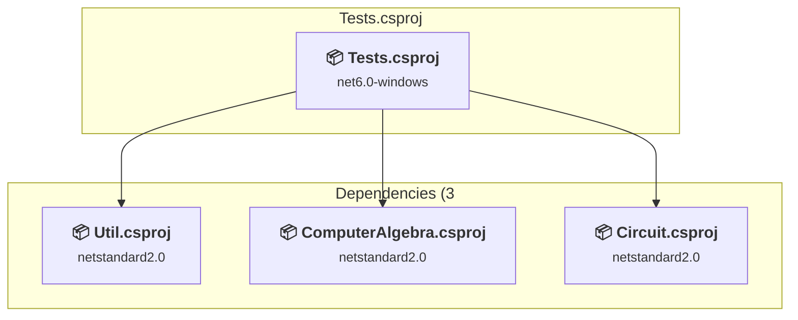

### API Compatibility

| Category | Count | Impact |
| :--- | :---: | :--- |
| 🔴 Binary Incompatible | 90 | High - Require code changes |
| 🟡 Source Incompatible | 172 | Medium - Needs re-compilation and potential conflicting API error fixing |
| 🔵 Behavioral change | 0 | Low - Behavioral changes that may require testing at runtime |
| ✅ Compatible | 1650 |  |
| ***Total APIs Analyzed*** | ***1912*** |  |

#### Project Technologies and Features

| Technology | Issues | Percentage | Migration Path |
| :--- | :---: | :---: | :--- |
| Windows Forms | 90 | 34.4% | Windows Forms APIs for building Windows desktop applications with traditional Forms-based UI that are available in .NET on Windows. Enable Windows Desktop support: Option 1 (Recommended): Target net9.0-windows; Option 2: Add <UseWindowsDesktop>true</UseWindowsDesktop>; Option 3 (Legacy): Use Microsoft.NET.Sdk.WindowsDesktop SDK. |
| GDI+ / System.Drawing | 125 | 47.7% | System.Drawing APIs for 2D graphics, imaging, and printing that are available via NuGet package System.Drawing.Common. Note: Not recommended for server scenarios due to Windows dependencies; consider cross-platform alternatives like SkiaSharp or ImageSharp for new code. |

### Util\Util.csproj

#### Project Info

- **Current Target Framework:** netstandard2.0✅
- **SDK-style**: True
- **Project Kind:** ClassLibrary
- **Dependencies**: 0
- **Dependants**: 9
- **Number of Files**: 3
- **Number of Files with Incidents**: 1
- **Lines of Code**: 294
- **Estimated LOC to modify**: 0+ (at least 0.0% of the project)

#### Dependency Graph

Legend:
📦 SDK-style project
⚙️ Classic project

```mermaid
flowchart TB
    subgraph upstream["Dependants (9)"]
        P1["<b>📦&nbsp;Circuit.csproj</b><br/><small>netstandard2.0</small>"]
        P2["<b>📦&nbsp;LiveSPICE.csproj</b><br/><small>net6.0-windows</small>"]
        P3["<b>📦&nbsp;Audio.csproj</b><br/><small>netstandard2.0</small>"]
        P5["<b>📦&nbsp;Tests.csproj</b><br/><small>net6.0-windows</small>"]
        P6["<b>📦&nbsp;Asio.csproj</b><br/><small>netstandard2.0</small>"]
        P8["<b>📦&nbsp;WaveAudio.csproj</b><br/><small>netstandard2.0</small>"]
        P9["<b>📦&nbsp;SchematicControls.csproj</b><br/><small>net6.0-windows</small>"]
        P10["<b>📦&nbsp;LiveSPICEVst.csproj</b><br/><small>net8.0-windows</small>"]
        P11["<b>📦&nbsp;MockVst.csproj</b><br/><small>net8.0-windows</small>"]
        click P1 "#circuitcircuitcsproj"
        click P2 "#livespicelivespicecsproj"
        click P3 "#audioaudiocsproj"
        click P5 "#teststestscsproj"
        click P6 "#asioasiocsproj"
        click P8 "#waveaudiowaveaudiocsproj"
        click P9 "#schematiccontrolsschematiccontrolscsproj"
        click P10 "#livespicevstlivespicevstcsproj"
        click P11 "#mockvstmockvstcsproj"
    end
    subgraph current["Util.csproj"]
        MAIN["<b>📦&nbsp;Util.csproj</b><br/><small>netstandard2.0</small>"]
        click MAIN "#utilutilcsproj"
    end
    P1 --> MAIN
    P2 --> MAIN
    P3 --> MAIN
    P5 --> MAIN
    P6 --> MAIN
    P8 --> MAIN
    P9 --> MAIN
    P10 --> MAIN
    P11 --> MAIN

```

### API Compatibility

| Category | Count | Impact |
| :--- | :---: | :--- |
| 🔴 Binary Incompatible | 0 | High - Require code changes |
| 🟡 Source Incompatible | 0 | Medium - Needs re-compilation and potential conflicting API error fixing |
| 🔵 Behavioral change | 0 | Low - Behavioral changes that may require testing at runtime |
| ✅ Compatible | 270 |  |
| ***Total APIs Analyzed*** | ***270*** |  |

### WaveAudio\WaveAudio.csproj

#### Project Info

- **Current Target Framework:** netstandard2.0✅
- **SDK-style**: True
- **Project Kind:** ClassLibrary
- **Dependencies**: 2
- **Dependants**: 1
- **Number of Files**: 9
- **Number of Files with Incidents**: 1
- **Lines of Code**: 705
- **Estimated LOC to modify**: 0+ (at least 0.0% of the project)

#### Dependency Graph

Legend:
📦 SDK-style project
⚙️ Classic project

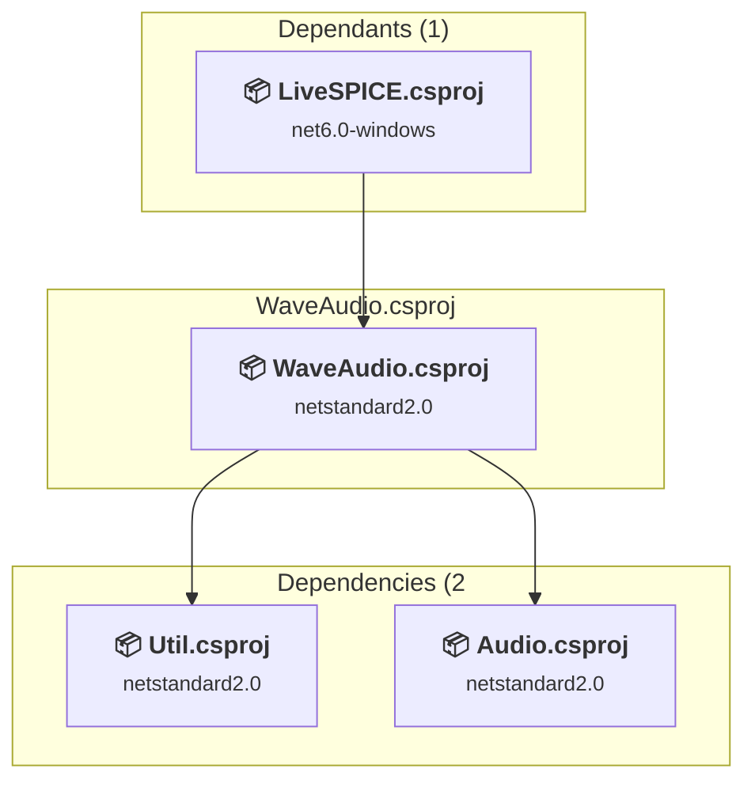

### API Compatibility

| Category | Count | Impact |
| :--- | :---: | :--- |
| 🔴 Binary Incompatible | 0 | High - Require code changes |
| 🟡 Source Incompatible | 0 | Medium - Needs re-compilation and potential conflicting API error fixing |
| 🔵 Behavioral change | 0 | Low - Behavioral changes that may require testing at runtime |
| ✅ Compatible | 760 |  |
| ***Total APIs Analyzed*** | ***760*** |  |

